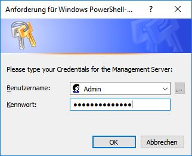

# Readme

about **SmartConsole for Web Site Management** (Release 16.0 and also 11.2).


## General

For more information about *SmartConsole for Web Site Management*, please have a look into these documents:

- [CHANGELOG](CHANGELOG.md)
- [OVERVIEW](Wiki/OVERVIEW.md)
- [FAQ](Wiki/FAQ.md)


## Requirements

*SmartConsole* requires PowerShell (WMF) 4.0 or higher. Likewise, basic settings require administrator rights. Because, depending on the settings, you are otherwise unable to import the package.

To check the PowerShell version, you can simply use the command in the PowerShell console:

```powershell
PS ..\> $PSVersionTable
```

The result is the technical data of the currently installed PowerShell version.

```powershell
Name                           Value
----                           -----
PSVersion                      5.1.14393.1944
PSEdition                      Desktop
PSCompatibleVersions           {1.0, 2.0, 3.0, 4.0...}
BuildVersion                   10.0.14393.1944
CLRVersion                     4.0.30319.42000
WSManStackVersion              3.0
PSRemotingProtocolVersion      2.3
SerializationVersion           1.1.0.1

PS: \> 
```

The desktop edition is necessary. For current limitations, please read the [KNOWNISSUES.md](Wiki/KNOWNISSUES.md) document.


## Installation

- Download the complete (zip) archive from GitHub.

- Extract the *SmartConsole* archive to any directory on the hard disk.

- Open PowerShell **as a Administrator** and **change into** the `..\SmartConsole>` subdirectory.

- Check you local policy in your PowerShell console:

   ```powershell
   PS ..\SmartConsole> Get-ExecutionPolicy
   ```

- You can set the execution policy to *bypass* for testing:

   ```powershell
   PS ..\SmartConsole> Set-ExecutionPolicy -ExecutionPolicy ("Bypass") -Force
   ```

- Execute the command:

   ```powershell
   PS ..\SmartConsole> Import-Module .\SmartConsole.psd1 -Force
   ```

- Now call the command:

   ```powershell
   PS ..\SmartConsole> Set-SecurePasswordFile
   ```

   and then enter the username and password for the OpenText™ Web Site Management Server:
   ​

   

   ​

- Next step is to set the default username, the URI to the Management Server and default project GUID for the default session:

   ```powershell
   PS ..\SmartConsole> Set-Configuration -Username ("Admin") -Uri ("https://localhost/CMS/WebService/RqlWebService.svc?WSDL") -ProjectGUID ("7C503F8E943E4E6CACE63B2DEB82BBF4")
   ```

- Change to subfolder `..\Helper\` and call the PowerShell script:

   ```powershell
   PS ..\SmartConsole\Helper> .\Test-RQLWebService.ps1
   ```

- After a successful login, you will get a list of all currently *logged on* user accounts of the Management Server. ;)


## Possible Errors

If the RQL-Webservice returns an error, please check the OpenText [Article ID:KB3223466](https://knowledge.opentext.com/knowledge/cs.dll/kcs/kbarticle/view/KB3223466) for more detailed information to fix it. 